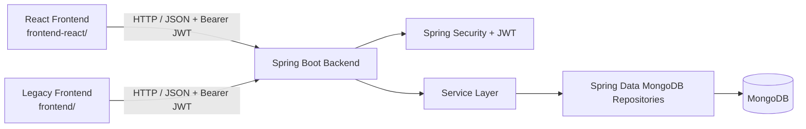

# Student Attendance System

A full-stack institutional attendance and academic management system built with Spring Boot, MongoDB, and React. The system reduces proxy attendance by requiring GPS-verified student self-attendance within a configurable campus radius, enforces faculty-scoped student ownership, blocks attendance on declared holidays, tracks subject-wise marks, and supports batch announcements with automatic expiry.

---

## Table of Contents

- [Overview](#overview)
- [Project Highlights](#project-highlights)
- [Application Architecture](#application-architecture)
- [Frontend Implementations: Primary vs. Legacy](#frontend-implementations-primary-vs-legacy)
- [Implemented Features](#implemented-features)
  - [Attendance Management & Geofencing](#attendance-management--geofencing)
  - [Holiday Management & Attendance Locking](#holiday-management--attendance-locking)
  - [Faculty Operations & Student Management](#faculty-operations--student-management)
  - [Academic Marks Tracking](#academic-marks-tracking)
  - [Batch Announcements](#batch-announcements)
- [Technology Stack](#technology-stack)
- [Database Schema & Models](#database-schema--models)
- [Authentication & Access Control](#authentication--access-control)
- [API Reference](#api-reference)
- [Configuration & Environment Variables](#configuration--environment-variables)
- [Local Development Setup](#local-development-setup)
- [Automated Testing](#automated-testing)

---

## Overview

The **Student Attendance System** is designed for educational institutions to streamline daily attendance taking, reduce proxy attendance through GPS-verified student self-check-in, and manage student academic records.

### Core Problems Addressed
1. **Proxy Attendance Reduction:** Students can only self-mark attendance if their device's GPS coordinates are verified to be within a configurable radius of the campus. GPS geofencing verifies device location, but does not prove the physical identity of the person holding the device.
2. **Attendance Integrity & Scheduling:** The system blocks attendance recording on declared institution holidays and enforces a unique composite constraint per student per date to eliminate duplicate submissions.
3. **Faculty Isolation & Ownership:** Student records, attendance entries, marks, and announcements are scoped to the authenticated faculty member who registered them.
4. **Academic & Communication Workflow:** Faculty can grade students across predefined core subjects and publish expiring announcements targeted to their assigned batches.

### Supported User Roles
- **Faculty (`ROLE_FACULTY`):** Manages enrolled students, manually marks or reviews daily attendance, records and updates marks, declares institution holidays, and publishes announcements.
- **Student (`ROLE_STUDENT`):** Authenticates via USN (University Seat Number), checks in daily via GPS geolocation, reviews individual attendance metrics and history, views subject marks, and checks active announcements and the holiday calendar.

---

## Project Highlights

- **GPS Geofence Verification** — Student self-attendance is validated against campus coordinates using the Haversine formula with a configurable radius threshold.
- **Stateless JWT Authentication** — HMAC-SHA256 signed tokens with role-based claims (`ROLE_FACULTY`, `ROLE_STUDENT`), verified per-request via a custom Spring Security filter chain.
- **Faculty-Scoped Data Isolation** — All student records, attendance entries, marks, and announcements are scoped to the faculty member who created them; cross-faculty access is rejected with HTTP 403.
- **Server-Side Date Enforcement** — Student attendance submissions have their date overwritten to `LocalDate.now()` on the backend, preventing retroactive or advance attendance spoofing regardless of client-submitted values.
- **Dual-Layer Duplicate Prevention** — Attendance uniqueness is enforced both at the application level (pre-save existence check) and at the database level (compound unique index on `{ studentUsn, date }`).
- **Holiday-Aware Attendance Blocking** — Attendance recording is rejected on declared holidays for both students and faculty, with proactive UI feedback disabling the check-in button.
- **Comprehensive Automated Test Suite** — 20 JUnit 5 + Mockito unit tests covering geofence rejection, holiday blocking, duplicate prevention, date spoofing resistance, and faculty ownership enforcement.
- **Full Frontend Migration Path** — Repository preserves both the original vanilla HTML/JS frontend and the current React 19 + Vite 8 SPA, demonstrating an incremental modernization approach.

---

## Application Architecture

The system is organized as a decoupled client-server architecture:



### Communication Flow
1. **Client Requests:** Client applications interact with the backend exclusively through HTTP JSON requests.
2. **Authentication:** Clients send credentials to `/auth/login` (faculty) or `/student/login` (student) and receive a signed HMAC-SHA256 JWT. Subsequent requests include this token in the `Authorization: Bearer <token>` header.
3. **Validation & Filtering:** `JwtAuthenticationFilter` validates token integrity and loads user authorities into the `SecurityContext`.
4. **Business Validation:** Services verify faculty-student ownership, calculate Haversine campus distances, verify holiday calendars, and guard against duplicate entries before persisting changes to MongoDB.

---

## Frontend Implementations: Primary vs. Legacy

The repository contains two frontend directories:

| Characteristic | Primary Frontend (`frontend-react/`) | Legacy Frontend (`frontend/`) |
| :--- | :--- | :--- |
| **Technology** | React 19, Vite 8, React Router DOM 7 | Vanilla HTML5, CSS3, Vanilla JavaScript (Fetch API) |
| **Status** | **Active / Current** | **Legacy / Archived** |
| **Routing** | Client-side declarative routing with `<ProtectedRoute>` | Page-based static HTML redirection (`window.location.href`) |
| **Feature Coverage** | Complete: Dashboard, Students, Attendance, Marks Modal, Announcements, Holidays, Student Dashboard | Partial: Dashboard, Student list (unpaginated), Attendance, Marks, Student Dashboard |
| **Pagination Support** | Yes (server-side pagination for students and announcements) | No (flat list rendering) |
| **Holiday & Announcements**| Fully integrated | Not present |

### Why Both Exist
The project originated with static HTML/JS pages under `frontend/`. In commit `f260d55`, the frontend was migrated to React and Vite (`frontend-react/`) to introduce component-based architecture, client-side routing, modular state management, and reusable modal dialogs. Subsequent enhancements (pagination, batch announcements, global holiday management, and dedicated faculty navigation pages) were built directly into `frontend-react/`. The original `frontend/` directory is retained in the repository as a historical reference.

---

## Implemented Features

### Attendance Management & Geofencing

- **GPS Geofence Validation:**
  - Student self-attendance marking requires browser geolocation coordinates (`latitude` and `longitude`).
  - The backend calculates distance between the student's device coordinates and preconfigured campus coordinates using the Haversine formula (Earth radius = $6,371,000$ meters).
  - Campus coordinates and allowed radius (default: 100 meters) are defined in `AttendanceServiceImpl.java` and can be adjusted for different institutions.
  - If coordinates are missing, an `InvalidLocationException` (HTTP 400) is thrown: *"Location data is missing."*
  - If distance exceeds 100 meters, an `InvalidLocationException` (HTTP 400) is thrown: *"You are outside the college campus."*
- **Server-Side Date Lockdown:**
  - When marked by a student, the attendance date is forced to `LocalDate.now()` on the backend. Client-submitted dates in the request body are disregarded, preventing retroactive or advance attendance spoofing.
- **Faculty Manual Attendance:**
  - Faculty can record attendance for their students for any selected date without GPS verification.
  - Faculty can set status to `Present` or `Absent`.
- **Smart Attendance Locking:**
  - The faculty attendance interface checks existing records for the selected date. Students with attendance already submitted are visually locked (`✓ Already Marked (Present/Absent)`), preventing accidental duplicate writes.
- **Duplicate Prevention:**
  - Pre-save existence check (`findByStudentUsnAndDate`).
  - Database-level unique compound index on `{ studentUsn: 1, date: 1 }`.
  - Duplicate attempts trigger `DuplicateAttendanceException` (HTTP 409): *"Attendance has already been marked for this student on this date."*
- **Summary Calculations:**
  - **Total Classes:** $\text{Total} = \text{Present} + \text{Absent}$
  - **Attendance Percentage:** $\text{Attendance Percentage} = \text{round}\left(\frac{\text{Present} \times 100.0}{\text{Total}}, 2\right)$

### Holiday Management & Attendance Locking

- **Institution-Wide Calendar:**
  - Faculty can create, edit, view, and delete declared holidays (`name`, unique `date`, optional `description`).
  - Dates have an indexed unique constraint; duplicate dates are rejected with `DuplicateHolidayException` (HTTP 409).
- **Strict Attendance Restriction:**
  - Whenever an attendance record is submitted (by a student or faculty), the system verifies `holidayRepository.findByDate(date)`.
  - If a holiday exists, attendance is rejected with `HolidayAttendanceException` (HTTP 400):
    *"Cannot mark attendance on holiday: <Holiday Name> (<Date>)"*
- **Proactive UI Feedback:**
  - The student dashboard verifies if current date is a holiday. If matched, the *Mark Attendance* button is disabled and an explanatory banner displays the holiday name and description.

### Faculty Operations & Student Management

- **Faculty-Scoped Ownership:**
  - When a faculty member registers a student, the student document is stamped with `facultyUsername = authentication.getName()`.
  - Faculty can only view, update, delete, or mark attendance for students they registered. Cross-faculty operations are rejected with HTTP 403 Forbidden.
- **Student CRUD:**
  - Required fields: `usn` (unique identifier), `name`, `branch`, `year` (1–4), and `password` (BCrypt-encoded on creation and update).
  - Editing a student retains the existing password if left blank.
- **Pagination & Search:**
  - Paginated student retrieval via `GET /students/page?page={page}&size={size}` (default size: 10, max size: 100).
  - Client-side real-time search filter matching student name or USN.

### Academic Marks Tracking

- **Predefined Subject Scope:**
  - Marks tracking is restricted to 5 supported subjects:
    - `DBMS`
    - `DSA`
    - `OS`
    - `Java`
    - `Computer Networks`
  - Any other subject key is rejected with HTTP 400: *"Invalid subject: <name>"*.
- **Score Validation:** Marks must be numeric values between 0 and 100.
- **Upload vs. Update Lifecycle:**
  - `POST /students/{usn}/marks`: Initial mark entry. Rejects existing subjects with HTTP 409 Conflict (*"Marks already uploaded for <subject>"*).
  - `PUT /students/{usn}/marks`: Updates an existing mark. Rejects unrecorded subjects with HTTP 404 Not Found (*"Marks not found for <subject>"*).
- **Interface Support:**
  - Faculty `MarksModal` in `frontend-react` provides single-subject submit buttons and batch submission for all modified fields.
  - Students view their uploaded marks directly on their dashboard in a dedicated *Academic Marks* table.

### Batch Announcements

- **Faculty Publishing:**
  - Faculty can post announcements specifying `title`, `description`, and an optional `expiryDate`.
  - Stamped automatically with `creationDate = LocalDate.now()` and `facultyUsername`.
  - Faculty can edit, delete, and view a paginated list of their announcements.
- **Student Consumption:**
  - `GET /announcements/student`: Automatically resolves the logged-in student's assigned faculty and returns active announcements (`expiryDate == null OR expiryDate >= today`).
  - Announcements are displayed in a responsive card grid with creation and expiration date indicators.

---

## Technology Stack

### Backend
- **Language:** Java 25
- **Framework:** Spring Boot 4.1.0 (`spring-boot-starter-webmvc`, `spring-boot-starter-security`, `spring-boot-starter-validation`)
- **Database Access:** Spring Data MongoDB (`spring-boot-starter-data-mongodb`)
- **Authentication:** JJWT (`io.jsonwebtoken:jjwt-api:0.12.6`, `jjwt-impl`, `jjwt-jackson`)
- **Utility:** Project Lombok
- **Build Tool:** Apache Maven (configured with `mvnw` wrapper)

### Frontend (Primary - `frontend-react/`)
- **Library:** React 19 (`react: ^19.2.8`, `react-dom: ^19.2.8`)
- **Tooling & Bundler:** Vite 8 (`vite: ^8.2.0`)
- **Compiler:** Babel React Compiler (`babel-plugin-react-compiler`, `@rolldown/plugin-babel`)
- **Routing:** React Router DOM 7 (`react-router-dom: ^7.18.2`)
- **Styling:** Custom CSS with CSS variables (`src/css/style.css`)

### Frontend (Legacy - `frontend/`)
- **Core:** Semantic HTML5, CSS3, ES6 JavaScript (Fetch API, LocalStorage).

### Database
- **Engine:** MongoDB (Document-oriented NoSQL database)

---

## Database Schema & Models

### 1. `Student` (Collection: `students`)
| Field | Type | Constraints / Details |
| :--- | :--- | :--- |
| `usn` | `String` | Document ID (`@Id`), required, primary student identifier |
| `name` | `String` | Required |
| `branch` | `String` | Required |
| `year` | `int` | Validated between 1 and 4 |
| `facultyUsername` | `String` | Username of the faculty member who registered this student |
| `password` | `String` | Write-only (`@JsonProperty(access = WRITE_ONLY)`), BCrypt encoded |
| `role` | `Role` | Enum: `STUDENT` |
| `marks` | `Map<String, Integer>` | Keyed by subject name, values 0–100 |

### 2. `Faculty` (Collection: `faculties`)
| Field | Type | Constraints / Details |
| :--- | :--- | :--- |
| `id` | `String` | Document ID (`@Id`) |
| `name` | `String` | Faculty full name |
| `username` | `String` | Unique login username |
| `password` | `String` | Write-only, BCrypt encoded |
| `role` | `Role` | Enum: `FACULTY` |

### 3. `Attendance` (Collection: `attendance`)
| Field | Type | Constraints / Details |
| :--- | :--- | :--- |
| `id` | `String` | Document ID (`@Id`) |
| `studentUsn` | `String` | USN of the student |
| `date` | `LocalDate` | Date of attendance (ISO `YYYY-MM-DD`) |
| `markedAt` | `LocalDateTime`| Exact timestamp of marking |
| `status` | `AttendanceStatus` | Enum: `Present`, `Absent` |
| `latitude` | `Double` | Geolocation latitude (null for faculty entries) |
| `longitude` | `Double` | Geolocation longitude (null for faculty entries) |

*Index:* Compound unique index `student_date_unique_idx` on `{ studentUsn: 1, date: 1 }`.

### 4. `Holiday` (Collection: `holidays`)
| Field | Type | Constraints / Details |
| :--- | :--- | :--- |
| `id` | `String` | Document ID (`@Id`) |
| `name` | `String` | Required holiday title |
| `date` | `LocalDate` | Required, indexed unique (`@Indexed(unique = true)`) |
| `description` | `String` | Optional details |
| `createdAt` | `LocalDate` | Automatic creation date (`LocalDate.now()`) |

### 5. `Announcement` (Collection: `announcements`)
| Field | Type | Constraints / Details |
| :--- | :--- | :--- |
| `id` | `String` | Document ID (`@Id`) |
| `title` | `String` | Announcement headline |
| `description` | `String` | Announcement body text |
| `creationDate` | `LocalDate` | Automatic creation date (`LocalDate.now()`) |
| `expiryDate` | `LocalDate` | Optional expiration date |
| `facultyUsername` | `String` | Owning faculty member's username |

---

## Authentication & Access Control

The backend implements stateless Spring Security with JWT authentication.

### Token Specification
- **Algorithm:** HMAC-SHA256 (`Keys.hmacShaKeyFor`)
- **Claims:** Subject (`sub`) holds the username or USN; custom claim `role` contains authority (e.g. `ROLE_FACULTY` or `ROLE_STUDENT`).
- **Expiration:** Configurable via `app.jwt.expiration-ms` (default: 3,600,000 ms = 1 hour).

### Seed Account Initialization
`FacultyDataInitializer` runs on application startup. If the `faculties` collection has zero records, an initial account is seeded:
- **Name:** `System Administrator`
- **Username:** Value of `app.faculty.initial-username` (default: `admin`)
- **Password:** Supplied via the `INITIAL_FACULTY_PASSWORD` environment variable (required on initial startup)
- **Role:** `FACULTY`

### Endpoint Authorization Rules

| Path Pattern | Allowed Role / Condition |
| :--- | :--- |
| `/auth/login`, `/student/login` | Public (`permitAll()`) |
| `/student/**` | `ROLE_STUDENT` |
| `/students/marks` | `ROLE_STUDENT` or `ROLE_FACULTY` |
| `/students/**`, `/students` | `ROLE_FACULTY` |
| `POST /attendance` | `ROLE_STUDENT` (GPS verified) or `ROLE_FACULTY` (manual) |
| `GET`, `PUT`, `DELETE /attendance/**` | `ROLE_FACULTY` |
| `POST`, `PUT`, `DELETE /announcements/**` | `ROLE_FACULTY` |
| `GET /announcements` | `ROLE_FACULTY` |
| `GET /announcements/student` | `ROLE_STUDENT` |
| `POST`, `PUT`, `DELETE /holidays/**` | `ROLE_FACULTY` |
| `GET /holidays/**`, `GET /holidays` | `ROLE_STUDENT` or `ROLE_FACULTY` |

---

## API Reference

All protected endpoints require the header `Authorization: Bearer <token>`.

### Authentication

#### Faculty Login
- **Endpoint:** `POST /auth/login`
- **Request Body:**
  ```json
  {
    "username": "<faculty-username>",
    "password": "<faculty-password>"
  }
  ```
- **Success Response (200 OK):**
  ```json
  {
    "token": "<jwt-token-string>",
    "username": "<faculty-username>",
    "role": "FACULTY"
  }
  ```

#### Student Login
- **Endpoint:** `POST /student/login`
- **Request Body:**
  ```json
  {
    "usn": "1AH22CS001",
    "password": "studentPassword"
  }
  ```
- **Success Response (200 OK):**
  ```json
  {
    "token": "<jwt-token-string>",
    "username": "1AH22CS001",
    "role": "STUDENT"
  }
  ```

---

### Student Self-Service

| Method | Endpoint | Description |
| :--- | :--- | :--- |
| `GET` | `/student/me` | Returns profile of the authenticated student (`usn`, `name`, `branch`, `year`). |
| `GET` | `/student/me/attendance` | Returns summary metrics (`presentCount`, `absentCount`, `attendancePercentage`) and attendance history list. |
| `POST` | `/attendance` | Self-marks student attendance. Expects `{ "latitude": double, "longitude": double }`. |
| `GET` | `/students/marks` | Returns the authenticated student's marks map (`{ "DBMS": 85, ... }`). |
| `GET` | `/announcements/student?page=0&size=5` | Returns active, unexpired announcements from the student's faculty. |
| `GET` | `/holidays/student` | Returns institution-wide holidays sorted by date ascending. |

---

### Faculty Management

#### Students
| Method | Endpoint | Description |
| :--- | :--- | :--- |
| `GET` | `/students` | Returns all students registered by the authenticated faculty. |
| `GET` | `/students/page?page=0&size=10` | Returns paginated student records for the faculty. |
| `POST` | `/students` | Enrolls a new student. Body: `{ name, usn, branch, year, password }`. |
| `GET` | `/students/{usn}` | Fetches a student record by USN. |
| `PUT` | `/students/{usn}` | Updates student profile details. Password field is optional. |
| `DELETE`| `/students/{usn}` | Deletes a student record. |

#### Academic Marks
| Method | Endpoint | Description |
| :--- | :--- | :--- |
| `POST` | `/students/{usn}/marks` | Initial upload of subject marks. Body: `{ "DBMS": 85 }`. |
| `PUT` | `/students/{usn}/marks` | Updates existing subject marks. Body: `{ "DBMS": 90 }`. |

#### Attendance
| Method | Endpoint | Description |
| :--- | :--- | :--- |
| `GET` | `/attendance` | Retrieves all attendance records for the faculty's students. |
| `GET` | `/attendance?date=YYYY-MM-DD` | Retrieves attendance status list for a specific date. |
| `GET` | `/attendance/{id}` | Retrieves a single attendance record by ID. |
| `POST` | `/attendance` | Records attendance manually. Body: `{ studentUsn, date, status }`. |
| `PUT` | `/attendance/{id}` | Updates an existing attendance record. |
| `DELETE`| `/attendance/{id}` | Deletes an attendance record. |

#### Holidays
| Method | Endpoint | Description |
| :--- | :--- | :--- |
| `GET` | `/holidays` | Returns all holidays ordered by date ascending. |
| `GET` | `/holidays/page?page=0&size=10` | Returns paginated holidays. |
| `POST` | `/holidays` | Declares a new holiday. Body: `{ name, date, description }`. |
| `GET` | `/holidays/{id}` | Retrieves holiday details by ID. |
| `PUT` | `/holidays/{id}` | Updates a holiday record. |
| `DELETE`| `/holidays/{id}` | Deletes a holiday. |

#### Announcements
| Method | Endpoint | Description |
| :--- | :--- | :--- |
| `GET` | `/announcements?page=0&size=5` | Retrieves paginated announcements created by the faculty. |
| `POST` | `/announcements` | Publishes an announcement. Body: `{ title, description, expiryDate }`. |
| `PUT` | `/announcements/{id}` | Updates an announcement. |
| `DELETE`| `/announcements/{id}` | Deletes an announcement. |

---

## Configuration & Environment Variables

### Backend Configuration (`backend/attendance/src/main/resources/application.properties`)

The application requires configuration through environment variables or JVM system properties. No secrets or credentials are hardcoded in the repository. A reference template is provided in `.env.example` at the repository root.

> [!NOTE]
> Spring Boot does not automatically read `.env` files out of the box. Variables must be set as shell environment variables in your terminal, configured in your IDE run configuration, or passed as system properties.

| Property | Default Value | Environment Variable | Required? | Description |
| :--- | :--- | :--- | :--- | :--- |
| `spring.application.name` | `attendance` | — | No | Application identifier |
| `spring.mongodb.uri` | — | `MONGODB_URI` | **Yes** | MongoDB connection URI (e.g. `mongodb://localhost:27017/attendance_db` or Atlas URI) |
| `app.jwt.secret` | — | `JWT_SECRET` | **Yes** | Base64-encoded secret key (minimum 256 bits) for HMAC-SHA256 signing |
| `app.jwt.expiration-ms` | `3600000` (1 hour) | `JWT_EXPIRATION_MS` | No | JWT expiration duration in milliseconds |
| `app.faculty.initial-username` | `admin` | `INITIAL_FACULTY_USERNAME` | No | Seed faculty username created on clean start |
| `app.faculty.initial-password` | — | `INITIAL_FACULTY_PASSWORD` | **Yes** | Seed faculty password for initial administrator creation. |

### CORS Configuration (`CorsConfig.java`)
The backend accepts cross-origin requests from:
- `http://localhost:5173` (Vite dev server for `frontend-react`)
- `http://localhost:5500` / `http://127.0.0.1:5500` (Static server / VS Code Live Server for `frontend`)
- **Allowed HTTP Methods:** `GET`, `POST`, `PUT`, `DELETE`, `OPTIONS`

---

## Local Development Setup

### Prerequisites
- **Java Development Kit (JDK):** Version 25
- **Node.js & npm:** Node.js 18+ and npm 10+
- **MongoDB:** Active MongoDB instance or MongoDB Atlas cluster URI

---

### Step 1: Run the Backend Service

1. Navigate to the backend directory:
   ```bash
   cd backend/attendance
   ```

2. Set the required environment variables in your terminal session before launching the app:
   - **On Linux / macOS:**
     ```bash
     export MONGODB_URI="mongodb://localhost:27017/attendance_db"
     export JWT_SECRET="your-base64-encoded-jwt-secret"
     export INITIAL_FACULTY_PASSWORD="your-secure-password"
     ```
     *(Note: If you maintain a local `.env` file, you can export it into your shell with `export $(grep -v '^#' .env | xargs)`).*
   - **On Windows (PowerShell):**
     ```powershell
     $env:MONGODB_URI="mongodb://localhost:27017/attendance_db"
     $env:JWT_SECRET="your-base64-encoded-jwt-secret"
     $env:INITIAL_FACULTY_PASSWORD="your-secure-password"
     ```
   - **On Windows (Command Prompt):**
     ```cmd
     set MONGODB_URI=mongodb://localhost:27017/attendance_db
     set JWT_SECRET=your-base64-encoded-jwt-secret
     set INITIAL_FACULTY_PASSWORD=your-secure-password
     ```

3. Verify compilation and dependencies using the Maven wrapper:
   - **On Linux / macOS:**
     ```bash
     ./mvnw clean compile
     ```
   - **On Windows:**
     ```cmd
     mvnw.cmd clean compile
     ```

4. Start the Spring Boot application:
   - **On Linux / macOS:**
     ```bash
     ./mvnw spring-boot:run
     ```
   - **On Windows:**
     ```cmd
     mvnw.cmd spring-boot:run
     ```
   The backend starts on port **8080** by default.

---

### Step 2: Run the Primary React Frontend

1. Open a separate terminal and navigate to `frontend-react`:
   ```bash
   cd frontend-react
   ```

2. Install Node dependencies:
   ```bash
   npm install
   ```

3. Launch the Vite development server:
   ```bash
   npm run dev
   ```
   The application will be accessible at:
   ```
   http://localhost:5173
   ```

4. Build for production:
   ```bash
   npm run build
   ```

---

### Step 3: (Optional) View the Legacy Frontend

If you wish to test the legacy static frontend:
1. Serve the `frontend/` directory using an HTTP server on port **5500** (e.g. using VS Code Live Server or `npx serve -l 5500 frontend`).
2. Navigate to `http://127.0.0.1:5500/login.html`.

---

## Automated Testing

The backend includes an automated test suite implemented with **JUnit 5** and **Mockito**.

### Running the Test Suite
From `backend/attendance`:
```bash
./mvnw test
```
*(On Windows: `mvnw.cmd test`)*

### Verified Test Suite (20 Tests Total)

1. **`AttendanceApplicationTests` (1 test):**
   - Verifies that the Spring Boot application context loads successfully.
2. **`AttendanceServiceImplTest` (10 tests):**
   - `studentSelfMarking_rejected_whenDateIsHoliday`: Verifies student attendance is blocked if today is a holiday.
   - `studentSelfMarking_ignoresCustomDateInRequest_andAlwaysUsesCurrentDate`: Verifies that student submissions cannot override the date.
   - `studentSelfMarking_rejectedIfTodayIsHoliday_evenIfRequestContainsNonHolidayDate`: Ensures date spoofing on holidays fails.
   - `facultyManualMarking_rejected_whenSelectedDateIsHoliday`: Verifies faculty cannot mark attendance on declared holidays.
   - `studentSelfMarking_succeeds_onNonHolidayDate`: Verifies valid check-in within campus radius.
   - `facultyManualMarking_succeeds_onNonHolidayDate_withSelectedDate`: Verifies faculty can mark attendance on arbitrary valid dates.
   - `markAttendance_throwsDuplicateException_whenAlreadyMarkedOnNonHoliday`: Confirms duplicate rejection.
   - `markAttendance_throwsInvalidLocationException_whenOutsideCampusOnNonHoliday`: Verifies rejection when outside 100m radius.
   - `studentSelfMarking_throwsForbidden_whenMarkingForAnotherStudent`: Ensures USN matching authenticated identity.
   - `facultyManualMarking_throwsForbidden_whenStudentNotOwnedByFaculty`: Ensures faculty-student ownership enforcement.
3. **`HolidayServiceImplTest` (8 tests):**
   - Validates holiday addition, duplicate date rejection, ascending chronological retrieval, lookup by ID, conflict-checking updates, and holiday deletion.
4. **`StudentServiceImplTest` (1 test):**
   - `addStudent_setsFacultyUsernameFromAuthenticatedUser`: Confirms that registering a student automatically links them to the active faculty username and BCrypt encodes the student password.
