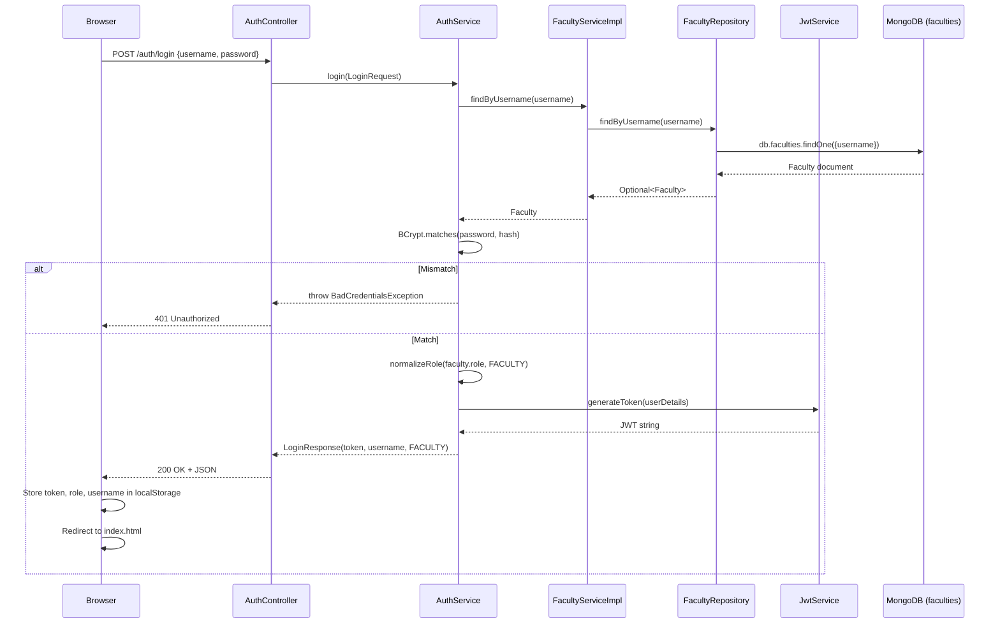
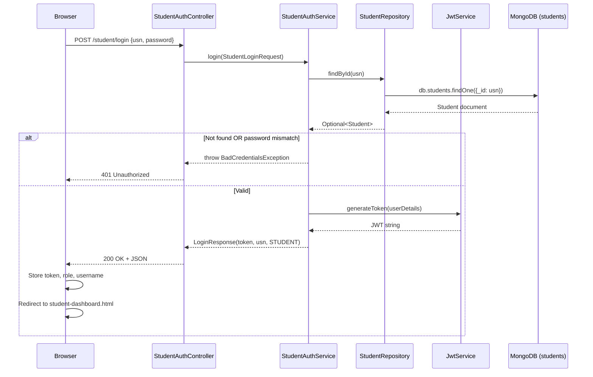
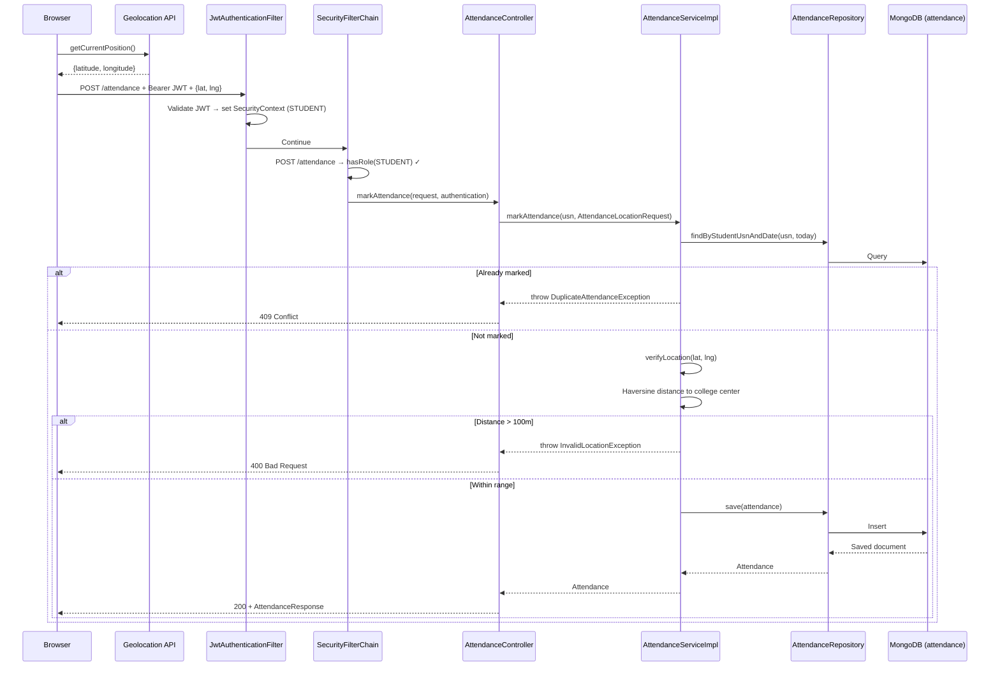
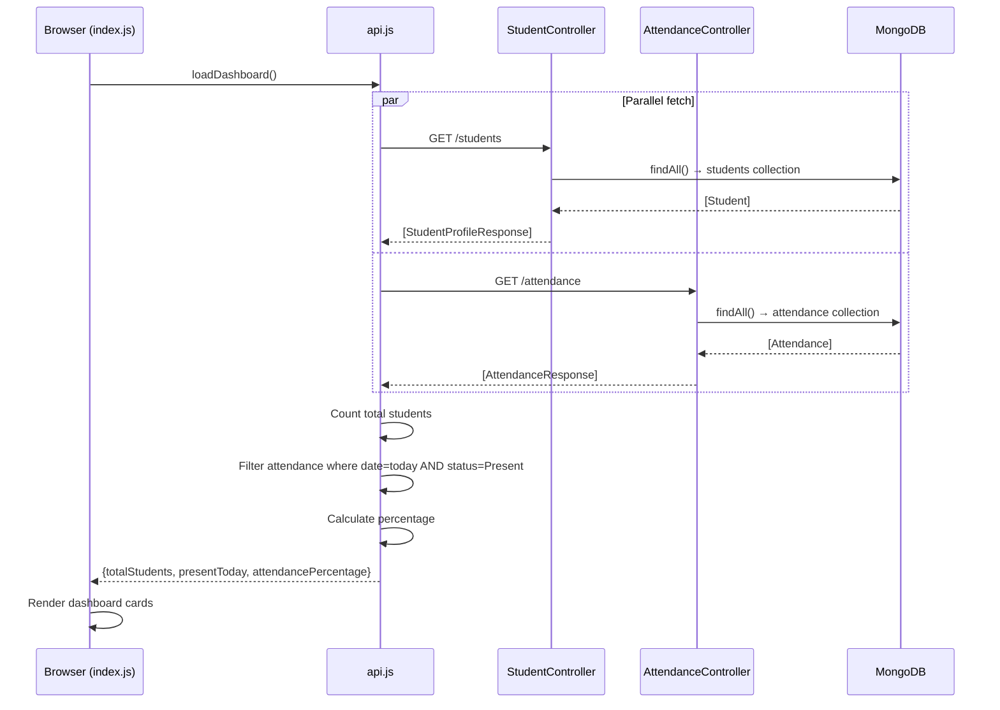
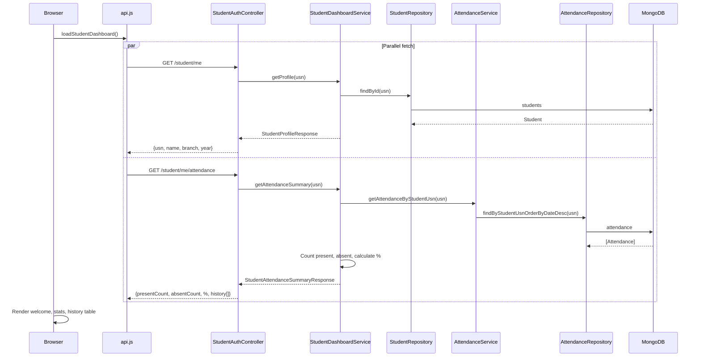
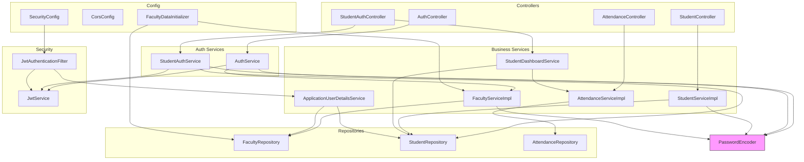

# Student Attendance System — Architecture Design Review

> **Reviewer**: Principal Software Engineer / Staff Backend Architect  
> **Date**: 2026-07-29  
> **Scope**: Complete backend (Spring Boot 4.1 + MongoDB) and frontend-backend integration  
> **Total backend files reviewed**: 33 Java source files, 1 application.properties, 1 pom.xml  
> **Total frontend files reviewed**: 5 HTML, 8 JS (for communication pattern analysis)

---

## Table of Contents

1. [High-Level Architecture](#1-high-level-architecture)
2. [Complete Request Lifecycle](#2-complete-request-lifecycle)
3. [Endpoint Catalogue](#3-endpoint-catalogue)
4. [Security Architecture](#4-security-architecture)
5. [Business Workflows](#5-business-workflows)
6. [Class Responsibility Review](#6-class-responsibility-review)
7. [Dependency Graph](#7-dependency-graph)
8. [Data Flow](#8-data-flow)
9. [Spring Boot Analysis](#9-spring-boot-analysis)
10. [MongoDB Analysis](#10-mongodb-analysis)
11. [Code Quality Review](#11-code-quality-review)
12. [API Design Review](#12-api-design-review)
13. [Security Review](#13-security-review)
14. [Maintainability Review](#14-maintainability-review)
15. [Architecture Score](#15-architecture-score)
16. [Final Refactoring Plan](#16-final-refactoring-plan)

---

## 1. High-Level Architecture

```
┌─────────────────────────────────────────────────────────────────┐
│                        BROWSER (Frontend)                       │
│  Static HTML + Vanilla JS served via Live Server (:5500)        │
│  localStorage: token, role, username                            │
└───────────────────────────┬─────────────────────────────────────┘
                            │ HTTP (JSON) + Bearer JWT
                            ▼
┌─────────────────────────────────────────────────────────────────┐
│                    SPRING BOOT 4.1.0  (:8080)                   │
│                                                                 │
│  ┌───────────────────────────────────────────────────────────┐  │
│  │  Servlet Filter Chain                                      │  │
│  │   ├─ CorsFilter (via CorsConfig WebMvcConfigurer)         │  │
│  │   ├─ JwtAuthenticationFilter (OncePerRequestFilter)       │  │
│  │   └─ Spring Security FilterChain (SecurityConfig)         │  │
│  └───────────────────────────────────────────────────────────┘  │
│                            │                                     │
│  ┌───────────────────────────────────────────────────────────┐  │
│  │  Controllers                                               │  │
│  │   ├─ AuthController          (/auth)                      │  │
│  │   ├─ StudentAuthController   (/student)                   │  │
│  │   ├─ StudentController       (/students)                  │  │
│  │   └─ AttendanceController    (/attendance)                │  │
│  └───────────────────────────────────────────────────────────┘  │
│                            │                                     │
│  ┌───────────────────────────────────────────────────────────┐  │
│  │  Services                                                  │  │
│  │   ├─ AuthService              (faculty login)             │  │
│  │   ├─ StudentAuthService       (student login)             │  │
│  │   ├─ FacultyServiceImpl       (faculty CRUD/registration) │  │
│  │   ├─ StudentServiceImpl       (student CRUD)              │  │
│  │   ├─ AttendanceServiceImpl    (attendance CRUD + geo)     │  │
│  │   ├─ StudentDashboardService  (profile + summary)         │  │
│  │   └─ ApplicationUserDetailsService (Spring Security SPI)  │  │
│  └───────────────────────────────────────────────────────────┘  │
│                            │                                     │
│  ┌───────────────────────────────────────────────────────────┐  │
│  │  Repositories (Spring Data MongoDB)                        │  │
│  │   ├─ FacultyRepository                                    │  │
│  │   ├─ StudentRepository                                    │  │
│  │   └─ AttendanceRepository                                 │  │
│  └───────────────────────────────────────────────────────────┘  │
│                            │                                     │
└────────────────────────────┼────────────────────────────────────┘
                             ▼
┌─────────────────────────────────────────────────────────────────┐
│              MongoDB Atlas (attendance_db)                       │
│   Collections: faculties, students, attendance                  │
└─────────────────────────────────────────────────────────────────┘
```

### Layer Responsibilities

| Layer | Responsibility |
|---|---|
| **Browser** | Static HTML/JS SPA-like pages. Stores JWT in `localStorage`. Calls REST API via `fetch`. Routes by role after login. |
| **CORS Filter** | Allows `http://127.0.0.1:5500` and `http://localhost:5500`. Methods: GET, POST, PUT, DELETE, OPTIONS. Headers: Content-Type, Authorization. |
| **JwtAuthenticationFilter** | Extracts Bearer token from `Authorization` header. Parses JWT → loads `UserDetails` via `ApplicationUserDetailsService` → sets `SecurityContextHolder`. Catches all `RuntimeException` silently on failure. |
| **Spring Security FilterChain** | Stateless sessions. URL-based authorization rules mapping roles (FACULTY, STUDENT) to path patterns. CSRF disabled. Custom 401 for both authentication and authorization failures. |
| **Controllers** | Thin REST endpoints. Accept DTOs / domain models. Delegate to services. Map domain models → response DTOs manually. |
| **Services** | Business logic: authentication, password encoding, geolocation validation, attendance deduplication, dashboard aggregation. Interface + Impl pattern for Student, Faculty, Attendance. |
| **Repositories** | Spring Data MongoDB interfaces. Derived query methods. No custom queries. |
| **MongoDB** | Document store. Three collections. One compound unique index (`attendance.studentUsn + date`). |

---

## 2. Complete Request Lifecycle

### 2.1 Unauthenticated Request (Login)

```
Browser                                                  MongoDB
  │                                                        │
  │  POST /auth/login  {username, password}                │
  ├──────────────────────┐                                 │
  │                      ▼                                 │
  │              JwtAuthenticationFilter                   │
  │              (no Authorization header → pass through)  │
  │                      │                                 │
  │              SecurityFilterChain                       │
  │              ("/auth/login" → permitAll → allowed)     │
  │                      │                                 │
  │              AuthController.login()                    │
  │                      │                                 │
  │              AuthService.login()                       │
  │                      │                                 │
  │              FacultyServiceImpl.findByUsername()        │
  │                      │                                 │
  │              FacultyRepository.findByUsername()  ───────┤ faculties
  │                      │                                 │
  │              PasswordEncoder.matches()                 │
  │              (BCrypt comparison)                       │
  │                      │                                 │
  │              JwtService.generateToken()                │
  │              (HMAC-SHA key, 1hr expiry, role claim)    │
  │                      │                                 │
  │              LoginResponse(token, username, FACULTY)   │
  │◄─────────────────────┘                                 │
  │                                                        │
  │  Store: localStorage.token, .role, .username           │
  │  Redirect: index.html                                  │
```

### 2.2 Authenticated Request (e.g., Student marks attendance)

```
Browser                                                    MongoDB
  │                                                          │
  │  POST /attendance  {latitude, longitude}                 │
  │  Authorization: Bearer <jwt>                             │
  ├────────────────────┐                                     │
  │                    ▼                                     │
  │            JwtAuthenticationFilter                       │
  │            ├ Extract token from header                   │
  │            ├ jwtService.extractUsername(token)            │
  │            │   → parse JWT, verify HMAC signature        │
  │            │   → return subject (USN)                    │
  │            ├ SecurityContextHolder.getAuthentication()    │
  │            │   → null (first request in chain)           │
  │            ├ userDetailsService.loadUserByUsername(USN)   │
  │            │   → try facultyRepository.findByUsername()   │
  │            │     → empty                                 │
  │            │   → try studentRepository.findById(USN)     │
  │            │     → found Student                         │
  │            │   → build UserDetails(ROLE_STUDENT)         │
  │            ├ jwtService.isTokenValid(token, userDetails)  │
  │            │   → subject match + not expired → true      │
  │            ├ Set Authentication in SecurityContext        │
  │            └ continue filter chain                       │
  │                    │                                     │
  │            SecurityFilterChain                           │
  │            ├ POST /attendance → hasRole(STUDENT) ✓       │
  │            └ allowed                                     │
  │                    │                                     │
  │            AttendanceController.markAttendance()          │
  │            ├ authentication.getName() → USN              │
  │            └ attendanceService.markAttendance(USN, req)  │
  │                    │                                     │
  │            AttendanceServiceImpl.markAttendance()         │
  │            ├ Build Attendance object                     │
  │            ├ Check duplicate:                            │
  │            │   findByStudentUsnAndDate()  ───────────────┤ attendance
  │            │   → present? throw DuplicateAttendanceEx    │
  │            ├ verifyLocation()                            │
  │            │   → Haversine formula                       │
  │            │   → distance > 100m? throw InvalidLocation  │
  │            └ attendanceRepository.save() ────────────────┤ attendance
  │                    │                                     │
  │            Controller converts to AttendanceResponse     │
  │◄───────────────────┘                                     │
```

### 2.3 Authenticated Request (Faculty views all attendance)

```
Browser → Authorization: Bearer <jwt>
  → JwtAuthenticationFilter → loadUserByUsername(username)
    → facultyRepository.findByUsername() → found → ROLE_FACULTY
  → SecurityFilterChain → GET /attendance → hasRole(FACULTY) ✓
  → AttendanceController.getAllAttendance()
  → AttendanceServiceImpl.getAllAttendance()
  → attendanceRepository.findAll()  → [Attendance]
  → map to [AttendanceResponse]
  → 200 OK
```

### 2.4 Error Flows

| Scenario | Where it's caught | HTTP Response |
|---|---|---|
| Invalid JWT (malformed, expired, wrong key) | `JwtAuthenticationFilter` catch block → `SecurityContext` cleared | 401 (security entry point) |
| No `Authorization` header on protected route | Filter passes through → no auth set | 401 (security entry point) |
| Valid JWT but wrong role | SecurityFilterChain `accessDeniedHandler` | 401 (misconfigured — should be 403) |
| Bad credentials during login | Controller catches `BadCredentialsException` | 401 |
| Student not found | `GlobalExceptionHandler` | 404 |
| Attendance not found | `GlobalExceptionHandler` | 404 |
| Duplicate attendance | `GlobalExceptionHandler` | 409 |
| Outside campus | `GlobalExceptionHandler` | 400 |
| Unhandled exceptions | Spring default error handling | 500 (no global catch-all handler) |

---

## 3. Endpoint Catalogue

| # | URL | Method | Purpose | Request DTO | Response DTO | Auth? | Role | Service Called | Repository Methods | Exceptions | Collection |
|---|---|---|---|---|---|---|---|---|---|---|---|
| 1 | `/auth/login` | POST | Faculty login | `LoginRequest` (username, password) | `LoginResponse` (token, username, role) | No | — | `AuthService.login()` | `FacultyRepository.findByUsername()` | `BadCredentialsException` → 401 | `faculties` |
| 2 | `/student/login` | POST | Student login | `StudentLoginRequest` (usn, password) | `LoginResponse` (token, username, role) | No | — | `StudentAuthService.login()` | `StudentRepository.findById()` | `BadCredentialsException` → 401 | `students` |
| 3 | `/student/me` | GET | Get current student profile | — | `StudentProfileResponse` (usn, name, branch, year) | Yes | STUDENT | `StudentDashboardService.getProfile()` | `StudentRepository.findById()` | `UsernameNotFoundException` → 500 (unhandled!) | `students` |
| 4 | `/student/me/attendance` | GET | Get current student attendance summary | — | `StudentAttendanceSummaryResponse` (presentCount, absentCount, %, history[]) | Yes | STUDENT | `StudentDashboardService.getAttendanceSummary()` | `AttendanceRepository.findByStudentUsnOrderByDateDesc()` | `UsernameNotFoundException` → 500 | `students`, `attendance` |
| 5 | `/students` | POST | Add new student | `Student` (raw model) | `StudentProfileResponse` | Yes | FACULTY | `StudentServiceImpl.addStudent()` | `StudentRepository.save()` | `DuplicateKeyException` → 500 (unhandled!) | `students` |
| 6 | `/students` | GET | List all students | — | `List<StudentProfileResponse>` | Yes | FACULTY | `StudentServiceImpl.getAllStudents()` | `StudentRepository.findAll()` | — | `students` |
| 7 | `/students/{usn}` | GET | Get student by USN | — | `StudentProfileResponse` | Yes | FACULTY | `StudentServiceImpl.getStudentByUsn()` | `StudentRepository.findById()` | `StudentNotFoundException` → 404 | `students` |
| 8 | `/students/{usn}` | PUT | Update student | `Student` (raw model) | `StudentProfileResponse` | Yes | FACULTY | `StudentServiceImpl.updateStudent()` | `StudentRepository.findById()`, `.save()` | `StudentNotFoundException` → 404 | `students` |
| 9 | `/students/{usn}` | DELETE | Delete student | — | `void` (200) | Yes | FACULTY | `StudentServiceImpl.deleteStudent()` | `StudentRepository.findById()`, `.delete()` | `StudentNotFoundException` → 404 | `students` |
| 10 | `/attendance` | POST | Mark attendance (geolocation) | `AttendanceLocationRequest` (latitude, longitude) | `AttendanceResponse` | Yes | STUDENT | `AttendanceServiceImpl.markAttendance()` | `findByStudentUsnAndDate()`, `.save()` | `DuplicateAttendanceException` → 409, `InvalidLocationException` → 400, `DuplicateKeyException` → 409 | `attendance` |
| 11 | `/attendance` | GET | List all attendance | — | `List<AttendanceResponse>` | Yes | FACULTY | `AttendanceServiceImpl.getAllAttendance()` | `AttendanceRepository.findAll()` | — | `attendance` |
| 12 | `/attendance/{id}` | GET | Get attendance by ID | — | `AttendanceResponse` | Yes | FACULTY | `AttendanceServiceImpl.getAttendanceById()` | `AttendanceRepository.findById()` | `AttendanceNotFoundException` → 404 | `attendance` |
| 13 | `/attendance/{id}` | PUT | Update attendance | `Attendance` (raw model) | `AttendanceResponse` | Yes | FACULTY | `AttendanceServiceImpl.updateAttendance()` | `findById()`, `.save()` | `AttendanceNotFoundException` → 404 | `attendance` |
| 14 | `/attendance/{id}` | DELETE | Delete attendance | — | `void` (200) | Yes | FACULTY | `AttendanceServiceImpl.deleteAttendance()` | `findById()`, `.delete()` | `AttendanceNotFoundException` → 404 | `attendance` |

> **14 total endpoints discovered. None missed.**

---

## 4. Security Architecture

### 4.1 JWT Generation

```java
// JwtService.generateToken(UserDetails)
Jwts.builder()
    .subject(userDetails.getUsername())          // "admin" or "1BM22CS001"
    .claim("role", authority)                    // "ROLE_FACULTY" or "ROLE_STUDENT"
    .issuedAt(now)
    .expiration(now + 3600000ms)                 // 1 hour
    .signWith(hmacShaKey)                        // HMAC-SHA from base64 secret
    .compact()
```

**Secret**: Base64 encoded string `QXR0ZW5kYW5jZVN5c3RlbVNlY3JldEtleUZvclYxLjE=` → decodes to `AttendanceSystemSecretKeyForV1.1` (≈30 bytes). This is the **default** value, overridable via `JWT_SECRET` env variable.

**Key Derivation**: `Keys.hmacShaKeyFor(Decoders.BASE64.decode(secret))` — JJWT auto-selects HS256/HS384/HS512 based on key length. 30 bytes = 240 bits → **HS384** will be selected.

### 4.2 JWT Validation

```
JwtAuthenticationFilter.doFilterInternal():
  1. Extract "Authorization" header
  2. If absent or not "Bearer " prefixed → pass through (no auth set)
  3. Extract token substring
  4. TRY:
     a. jwtService.extractUsername(token) → parse + verify signature + return subject
     b. If username != null AND SecurityContext has no existing auth:
        c. Load UserDetails from ApplicationUserDetailsService
        d. jwtService.isTokenValid(token, userDetails):
           - subject matches UserDetails.username
           - expiration is after now
        e. If valid → set UsernamePasswordAuthenticationToken in SecurityContext
  5. CATCH RuntimeException → clear SecurityContext (silently swallowed)
  6. Continue filter chain
```

### 4.3 SecurityContext & Authentication Object

The `Authentication` object placed in the `SecurityContext` is:
```java
UsernamePasswordAuthenticationToken(
    principal = UserDetails,     // Spring Security User object
    credentials = null,          // cleared after authentication
    authorities = [GrantedAuthority("ROLE_FACULTY")] or [GrantedAuthority("ROLE_STUDENT")]
)
```

`authentication.getName()` returns the username (faculty username or student USN).

### 4.4 Authorization Flow

```
SecurityConfig.securityFilterChain():

  /auth/login          → permitAll
  /student/login       → permitAll
  /student/**          → hasRole(STUDENT)         ← NOTE: /student/login is checked FIRST by order
  /students/**         → hasRole(FACULTY)
  POST /attendance     → hasRole(STUDENT)
  GET /attendance/**   → hasRole(FACULTY)
  PUT /attendance/**   → hasRole(FACULTY)
  DELETE /attendance/* → hasRole(FACULTY)
  ERROR dispatches     → permitAll
  anyRequest()         → authenticated
```

> [!WARNING]
> The `accessDeniedHandler` returns **401** instead of **403**. This conflates "not authenticated" with "not authorized" — a semantic and REST correctness issue.

### 4.5 Role Checking

Roles are stored using Spring Security's `ROLE_` prefix convention:
- `User.withUsername(...).roles("FACULTY")` → authority = `ROLE_FACULTY`
- `hasRole("FACULTY")` → checks for `ROLE_FACULTY` authority

The JWT `role` claim stores the full authority string (e.g., `ROLE_FACULTY`), but this claim is **never read during validation**. The role is re-loaded from the database on every request via `ApplicationUserDetailsService`. This is actually good for security (role changes take effect immediately) but adds a DB call per request.

### 4.6 Logout Flow

There is **no backend logout endpoint**. Logout is purely client-side:
```javascript
// logout.js
localStorage.removeItem("token");
localStorage.removeItem("role");
localStorage.removeItem("username");
window.location.href = "login.html";
```

> [!IMPORTANT]
> There is no token blacklist or revocation mechanism. A stolen JWT remains valid until its natural expiry (1 hour). This is acceptable for an internship project but would be a critical gap in production.

### 4.7 Controller Protection Summary

| Controller | Protection Method |
|---|---|
| `AuthController` | `permitAll` on `/auth/login` |
| `StudentAuthController` | `permitAll` on `/student/login`; `hasRole(STUDENT)` on `/student/me`, `/student/me/attendance` |
| `StudentController` | `hasRole(FACULTY)` on all `/students/**` |
| `AttendanceController` | `hasRole(STUDENT)` on POST; `hasRole(FACULTY)` on GET/PUT/DELETE |

---

## 5. Business Workflows

### 5.1 Faculty Login



### 5.2 Student Login



### 5.3 Student Marks Attendance (Geolocation)



### 5.4 Faculty Dashboard (Frontend-Computed)



> [!NOTE]
> The faculty dashboard stats are computed **entirely in the frontend**. The backend has no dedicated dashboard endpoint for faculty. This means the frontend downloads ALL students and ALL attendance records to compute 3 numbers.

### 5.5 Student Dashboard



### 5.6 Student Management (Faculty CRUD)

```
Faculty adds student:
  POST /students {usn, name, branch, year, password}
  → StudentController.addStudent()
  → StudentServiceImpl.addStudent()
  → prepareStudentCredentials(): BCrypt encode password, set role=STUDENT
  → studentRepository.save()
  → Return StudentProfileResponse (no password)

Faculty updates student:
  PUT /students/{usn} {name, branch, year, password?}
  → StudentController.updateStudent()
  → StudentServiceImpl.updateStudent()
  → findById() or throw 404
  → Update name, branch, year. If password provided, BCrypt encode it.
  → Force role=STUDENT
  → save()
  → Return StudentProfileResponse

Faculty deletes student:
  DELETE /students/{usn}
  → StudentController.deleteStudent()
  → StudentServiceImpl.deleteStudent()
  → findById() or throw 404
  → delete()
  → 200 (empty body)
```

### 5.7 Attendance Management (Faculty CRUD)

```
Faculty views all attendance:
  GET /attendance → findAll() → [AttendanceResponse]

Faculty views single attendance:
  GET /attendance/{id} → findById() or 404 → AttendanceResponse

Faculty updates attendance:
  PUT /attendance/{id} {full Attendance model}
  → findById() or 404
  → Overwrite ALL fields (studentUsn, date, markedAt, status, lat, lng)
  → save()
  → AttendanceResponse

Faculty deletes attendance:
  DELETE /attendance/{id} → findById() or 404 → delete() → 200
```

---

## 6. Class Responsibility Review

### Controllers

| Controller | Responsibilities | SRP Compliance | Size | Notes |
|---|---|---|---|---|
| [AuthController](file:///c:/Users/Login/Documents/Projects/Student%20Attendance%20System/backend/attendance/src/main/java/com/student/attendance/controller/AuthController.java) | Faculty login only | ✅ Clean | 34 lines | Single endpoint, single purpose. Well done. |
| [StudentAuthController](file:///c:/Users/Login/Documents/Projects/Student%20Attendance%20System/backend/attendance/src/main/java/com/student/attendance/controller/StudentAuthController.java) | Student login + profile + attendance summary | ⚠️ Mixed | 52 lines | Mixes authentication (login) with dashboard data retrieval (profile, attendance). These are different domains. |
| [StudentController](file:///c:/Users/Login/Documents/Projects/Student%20Attendance%20System/backend/attendance/src/main/java/com/student/attendance/controller/StudentController.java) | Student CRUD (faculty-facing) | ✅ Clean | 52 lines | Standard CRUD controller. `toResponse()` helper is fine here. |
| [AttendanceController](file:///c:/Users/Login/Documents/Projects/Student%20Attendance%20System/backend/attendance/src/main/java/com/student/attendance/controller/AttendanceController.java) | Attendance CRUD + marking | ✅ Clean | 63 lines | Mixed student-facing (POST) and faculty-facing (GET/PUT/DELETE) but this is a design choice enforced at security level. Acceptable. |

### Services

| Service | Responsibilities | SRP Compliance | Notes |
|---|---|---|---|
| [AuthService](file:///c:/Users/Login/Documents/Projects/Student%20Attendance%20System/backend/attendance/src/main/java/com/student/attendance/auth/AuthService.java) | Faculty credential validation + JWT generation | ✅ | Focused. |
| [StudentAuthService](file:///c:/Users/Login/Documents/Projects/Student%20Attendance%20System/backend/attendance/src/main/java/com/student/attendance/auth/StudentAuthService.java) | Student credential validation + JWT generation | ✅ | Focused. Duplicates `normalizeRole()` from AuthService. |
| [FacultyServiceImpl](file:///c:/Users/Login/Documents/Projects/Student%20Attendance%20System/backend/attendance/src/main/java/com/student/attendance/service/FacultyServiceImpl.java) | Faculty registration + lookup | ✅ | Small and focused. |
| [StudentServiceImpl](file:///c:/Users/Login/Documents/Projects/Student%20Attendance%20System/backend/attendance/src/main/java/com/student/attendance/service/StudentServiceImpl.java) | Student CRUD + credential prep | ✅ | Clean. |
| [AttendanceServiceImpl](file:///c:/Users/Login/Documents/Projects/Student%20Attendance%20System/backend/attendance/src/main/java/com/student/attendance/service/AttendanceServiceImpl.java) | Attendance CRUD + geolocation + deduplication | ⚠️ Borderline | 133 lines. Haversine calculation is domain logic embedded here. Acceptable for project size but the geolocation concern could be extracted. |
| [StudentDashboardService](file:///c:/Users/Login/Documents/Projects/Student%20Attendance%20System/backend/attendance/src/main/java/com/student/attendance/service/StudentDashboardService.java) | Profile + attendance aggregation | ✅ | Good composition of existing services. |
| [ApplicationUserDetailsService](file:///c:/Users/Login/Documents/Projects/Student%20Attendance%20System/backend/attendance/src/main/java/com/student/attendance/service/ApplicationUserDetailsService.java) | Spring Security SPI — loads UserDetails from both Faculty and Student | ⚠️ | Two-table lookup is necessary but makes it a fan-out point. Duplicates `normalizeRole()`. |

### Repositories

| Repository | Notes |
|---|---|
| [StudentRepository](file:///c:/Users/Login/Documents/Projects/Student%20Attendance%20System/backend/attendance/src/main/java/com/student/attendance/repository/StudentRepository.java) | Empty beyond `MongoRepository`. Uses `String` (USN) as ID. ✅ |
| [FacultyRepository](file:///c:/Users/Login/Documents/Projects/Student%20Attendance%20System/backend/attendance/src/main/java/com/student/attendance/repository/FacultyRepository.java) | One derived query: `findByUsername`. ✅ |
| [AttendanceRepository](file:///c:/Users/Login/Documents/Projects/Student%20Attendance%20System/backend/attendance/src/main/java/com/student/attendance/repository/AttendanceRepository.java) | Two derived queries. ✅ |

### Security Classes

| Class | Notes |
|---|---|
| [JwtService](file:///c:/Users/Login/Documents/Projects/Student%20Attendance%20System/backend/attendance/src/main/java/com/student/attendance/security/JwtService.java) | Clean. Constructor injection of config values. Signing key created once at startup. |
| [JwtAuthenticationFilter](file:///c:/Users/Login/Documents/Projects/Student%20Attendance%20System/backend/attendance/src/main/java/com/student/attendance/security/JwtAuthenticationFilter.java) | Catches `RuntimeException` too broadly. See Security Review. |

### Configuration Classes

| Class | Notes |
|---|---|
| [SecurityConfig](file:///c:/Users/Login/Documents/Projects/Student%20Attendance%20System/backend/attendance/src/main/java/com/student/attendance/config/SecurityConfig.java) | Uses `requestMatchers(request -> ...)` lambda style instead of pattern-based matchers. Functional but unusual. |
| [CorsConfig](file:///c:/Users/Login/Documents/Projects/Student%20Attendance%20System/backend/attendance/src/main/java/com/student/attendance/config/CorsConfig.java) | Hardcoded to localhost:5500. ✅ for dev. Needs env-based config for production. |
| [FacultyDataInitializer](file:///c:/Users/Login/Documents/Projects/Student%20Attendance%20System/backend/attendance/src/main/java/com/student/attendance/config/FacultyDataInitializer.java) | Seeds admin faculty if collection is empty. ✅ Good practice. |

### DTOs

| DTO | Type | Notes |
|---|---|---|
| `LoginRequest` | Record | ✅ Immutable |
| `LoginResponse` | Record | ✅ Immutable |
| `StudentLoginRequest` | Record | ✅ Immutable |
| `AttendanceLocationRequest` | Lombok `@Data` class | ⚠️ Mutable. Inconsistent with other DTOs (records). |
| `AttendanceResponse` | Record | ✅ |
| `StudentProfileResponse` | Record | ✅ |
| `StudentAttendanceRecordResponse` | Record | ✅ |
| `StudentAttendanceSummaryResponse` | Record | ✅ |

### Models

| Model | Notes |
|---|---|
| [Student](file:///c:/Users/Login/Documents/Projects/Student%20Attendance%20System/backend/attendance/src/main/java/com/student/attendance/model/Student.java) | Uses `@Id` on `usn` — makes USN the MongoDB `_id`. Good domain fit. `@JsonProperty(WRITE_ONLY)` on password. |
| [Faculty](file:///c:/Users/Login/Documents/Projects/Student%20Attendance%20System/backend/attendance/src/main/java/com/student/attendance/model/Faculty.java) | Auto-generated `_id`. `@JsonProperty(WRITE_ONLY)` on password. |
| [Attendance](file:///c:/Users/Login/Documents/Projects/Student%20Attendance%20System/backend/attendance/src/main/java/com/student/attendance/model/Attendance.java) | Has compound unique index. Latitude/longitude stored but stripped in response DTO. |
| [Role](file:///c:/Users/Login/Documents/Projects/Student%20Attendance%20System/backend/attendance/src/main/java/com/student/attendance/model/Role.java) | Simple enum: FACULTY, STUDENT. ✅ |
| [AttendanceStatus](file:///c:/Users/Login/Documents/Projects/Student%20Attendance%20System/backend/attendance/src/main/java/com/student/attendance/model/AttendanceStatus.java) | Enum: Present, Absent. ⚠️ Naming convention: should be `PRESENT`, `ABSENT` (Java enum convention). |

---

## 7. Dependency Graph



### Injection Chain (Who creates whom)

| Bean | Created By | Injected Into |
|---|---|---|
| `PasswordEncoder` (BCrypt) | `SecurityConfig.passwordEncoder()` | `AuthService`, `StudentAuthService`, `FacultyServiceImpl`, `StudentServiceImpl` |
| `AuthenticationProvider` (Dao) | `SecurityConfig.authenticationProvider()` | `SecurityFilterChain` |
| `AuthenticationManager` | `SecurityConfig.authenticationManager()` | Not injected anywhere (unused) |
| `JwtService` | Component scan (`@Service`) | `JwtAuthenticationFilter`, `AuthService`, `StudentAuthService` |
| `JwtAuthenticationFilter` | Component scan (`@Component`) | `SecurityConfig.securityFilterChain()` |
| `ApplicationUserDetailsService` | Component scan (`@Service`, `@Primary`) | `JwtAuthenticationFilter`, `DaoAuthenticationProvider` |
| `CommandLineRunner` | `FacultyDataInitializer.seedInitialFaculty()` | Spring Boot lifecycle |

### Dependency Issues

| Issue | Severity | Details |
|---|---|---|
| **`AuthenticationManager` bean is unused** | Low | Declared in `SecurityConfig` but never injected by any class. Dead bean. |
| **`normalizeRole()` duplicated 3x** | Low | Exists in `AuthService`, `StudentAuthService`, `ApplicationUserDetailsService`. Should be on the `Role` enum or a utility. |
| **`AuthService` depends on `FacultyService` (interface) but `StudentAuthService` depends directly on `StudentRepository`** | Low | Inconsistent abstraction level. Not a bug but asymmetric design. |

---

## 8. Data Flow

### 8.1 AttendanceLocationRequest → MongoDB

```
Browser
  │ {latitude: 12.971, longitude: 77.593}
  ▼
AttendanceLocationRequest (DTO)
  │ .getLatitude(), .getLongitude()
  ▼
AttendanceController.markAttendance()
  │ authentication.getName() → "1BM22CS001"
  ▼
AttendanceServiceImpl.markAttendance("1BM22CS001", request)
  │ Build Attendance object:
  │   studentUsn = "1BM22CS001"
  │   date = LocalDate.now()
  │   markedAt = LocalDateTime.now()
  │   status = Present
  │   latitude = request.getLatitude()
  │   longitude = request.getLongitude()
  │
  │ Duplicate check → findByStudentUsnAndDate()
  │ Location verification → Haversine
  ▼
AttendanceRepository.save(attendance)
  │
  ▼
MongoDB attendance collection:
  {
    _id: ObjectId("..."),
    studentUsn: "1BM22CS001",
    date: ISODate("2026-07-29"),
    markedAt: ISODate("2026-07-29T14:30:00"),
    status: "Present",
    latitude: 12.971,
    longitude: 77.593,
    _class: "com.student.attendance.model.Attendance"
  }
  │
  ▼
AttendanceResponse (returned to browser):
  {
    id: "...",
    studentUsn: "1BM22CS001",
    date: "2026-07-29",
    markedAt: "2026-07-29T14:30:00",
    status: "Present"
  }
  // NOTE: latitude and longitude are STRIPPED in the response DTO
```

### 8.2 Student Registration → MongoDB

```
Browser (Faculty)
  │ {usn: "1BM22CS001", name: "John", branch: "CSE", year: 2, password: "pass123"}
  ▼
StudentController.addStudent(@RequestBody Student student)
  │ NOTE: Accepts raw Student model, not a DTO!
  ▼
StudentServiceImpl.addStudent(student)
  │ prepareStudentCredentials():
  │   password = BCrypt.encode("pass123")  → "$2a$10$..."
  │   role = STUDENT
  ▼
StudentRepository.save(student)
  ▼
MongoDB students collection:
  {
    _id: "1BM22CS001",        // USN is the _id
    name: "John",
    branch: "CSE",
    year: 2,
    password: "$2a$10$...",    // BCrypt hash
    role: "STUDENT",
    _class: "com.student.attendance.model.Student"
  }
  ▼
StudentProfileResponse (returned):
  {usn: "1BM22CS001", name: "John", branch: "CSE", year: 2}
  // password excluded via manual mapping
```

### 8.3 Login → JWT → Authenticated Request

```
LoginRequest {username: "admin", password: "admin123"}
  ▼
AuthService.login()
  → Find Faculty → verify BCrypt → build UserDetails → generate JWT
  ▼
LoginResponse {token: "eyJhbG...", username: "admin", role: "FACULTY"}
  ▼
Browser: localStorage.setItem("token", "eyJhbG...")
  ▼
Next request: Authorization: Bearer eyJhbG...
  ▼
JwtAuthenticationFilter:
  → extractUsername() → "admin"
  → loadUserByUsername("admin") → Faculty found → UserDetails(ROLE_FACULTY)
  → isTokenValid() → true
  → SecurityContext.setAuthentication(ROLE_FACULTY)
  ▼
Controller: authentication.getName() → "admin"
```

---

## 9. Spring Boot Analysis

### 9.1 Application Startup Sequence

```
1. SpringApplication.run(AttendanceApplication.class)
2. Component scan: com.student.attendance.**
3. Auto-configuration:
   ├ MongoAutoConfiguration (from spring.mongodb.uri)
   ├ SecurityAutoConfiguration (spring-boot-starter-security)
   └ WebMvcAutoConfiguration (spring-boot-starter-webmvc)
4. Bean creation order (dependency-driven):
   ├ PasswordEncoder (SecurityConfig)
   ├ FacultyRepository, StudentRepository, AttendanceRepository (Spring Data)
   ├ JwtService (reads app.jwt.secret, app.jwt.expiration-ms)
   ├ ApplicationUserDetailsService (depends on repos)
   ├ JwtAuthenticationFilter (depends on JwtService, UserDetailsService)
   ├ AuthenticationProvider (depends on UserDetailsService, PasswordEncoder)
   ├ SecurityFilterChain (depends on AuthProvider, JwtFilter)
   ├ FacultyServiceImpl, StudentServiceImpl, AttendanceServiceImpl
   ├ AuthService, StudentAuthService
   ├ StudentDashboardService
   └ Controllers
5. CommandLineRunner (FacultyDataInitializer):
   ├ facultyRepository.count() → if 0:
   │   └ facultyService.register(Faculty("System Administrator", "admin", "admin123", FACULTY))
   │     → BCrypt encode "admin123" → save to faculties collection
   └ else: skip
6. Tomcat starts on port 8080
7. DevTools active (optional restart on class changes)
```

### 9.2 Bean Analysis

| Bean | Scope | Notes |
|---|---|---|
| `PasswordEncoder` | Singleton | BCrypt, thread-safe ✅ |
| `AuthenticationProvider` | Singleton | `DaoAuthenticationProvider` with custom `UserDetailsService` |
| `AuthenticationManager` | Singleton | **Unused** — registered but never injected |
| `SecurityFilterChain` | Singleton | Stateless, CSRF disabled, custom entry point |
| `JwtService` | Singleton | Signing key computed once at construction ✅ |
| `JwtAuthenticationFilter` | Singleton | `OncePerRequestFilter` — correct for Spring Security filter |
| `ApplicationUserDetailsService` | Singleton | `@Primary` ensures this is chosen over any auto-configured `UserDetailsService` |
| `CommandLineRunner` | Singleton | Executes once at startup |

### 9.3 Security Filter Chain Order

```
Request → CorsFilter → JwtAuthenticationFilter → UsernamePasswordAuthenticationFilter → AuthorizationFilter → Controller
                                                    ↑ (jwtFilter added BEFORE this)
```

### 9.4 Exception Flow

```
Controller/Service exception:
  ├ Caught by GlobalExceptionHandler (@RestControllerAdvice):
  │  ├ DuplicateAttendanceException → 409
  │  ├ StudentNotFoundException → 404
  │  ├ AttendanceNotFoundException → 404
  │  └ InvalidLocationException → 400
  │
  ├ NOT caught (falls through to Spring defaults):
  │  ├ UsernameNotFoundException → 500 (from StudentDashboardService)
  │  ├ DuplicateKeyException (MongoDB) on student save → 500
  │  └ Any other RuntimeException → 500
  │
  └ Security exceptions:
     ├ AuthenticationException → 401 (custom entry point: response.sendError(401))
     └ AccessDeniedException → 401 (custom access denied handler — should be 403)
```

---

## 10. MongoDB Analysis

### 10.1 Collections

| Collection | Document Structure | Primary Key | Indexes |
|---|---|---|---|
| `faculties` | `{_id, name, username, password, role, _class}` | Auto-generated ObjectId | Default `_id` only. **Missing**: unique index on `username`. |
| `students` | `{_id, name, branch, year, password, role, _class}` | USN (custom `_id` via `@Id` on `usn`) | Default `_id` only. |
| `attendance` | `{_id, studentUsn, date, markedAt, status, latitude, longitude, _class}` | Auto-generated ObjectId | `student_date_unique_idx` (compound unique on `{studentUsn, date}`) |

### 10.2 Index Analysis

| Index | Collection | Fields | Type | Purpose | Status |
|---|---|---|---|---|---|
| `_id_` | All | `_id` | Unique | Default MongoDB | ✅ Auto |
| `student_date_unique_idx` | `attendance` | `{studentUsn: 1, date: 1}` | Compound unique | Prevent duplicate daily attendance | ✅ Declared via `@CompoundIndex` |

### 10.3 Missing Indexes

> [!WARNING]
> **`faculties.username`** — No unique index. The `findByUsername` query runs on every authenticated request (via `ApplicationUserDetailsService`). Without an index, this is a **collection scan** on every request. Additionally, nothing prevents duplicate usernames in the `faculties` collection.

> [!NOTE]
> **`attendance.studentUsn`** — The `findByStudentUsnOrderByDateDesc` query used by the student dashboard would benefit from an index on `{studentUsn: 1, date: -1}`. The compound unique index `{studentUsn: 1, date: 1}` partially covers this but the sort order is ascending, not descending.

### 10.4 Relationships

```
faculties (standalone)
  └─ No references to other collections

students (standalone)
  └─ _id = USN (natural key)

attendance (references students implicitly)
  └─ studentUsn → students._id (no DBRef, no validation)
      ⚠️ No referential integrity: deleting a student does NOT delete their attendance records
```

### 10.5 Data Consistency Issues

| Issue | Severity | Description |
|---|---|---|
| **Orphaned attendance records** | Medium | Deleting a student via `DELETE /students/{usn}` does not cascade-delete their attendance records. The attendance records become orphaned with a `studentUsn` pointing to a non-existent student. |
| **No unique index on `faculties.username`** | Medium | Two faculties could theoretically share the same username. `findByUsername` would return the first one found. |
| **Race condition on attendance** | Low | The application checks for duplicates with `findByStudentUsnAndDate` before saving, but also handles `DuplicateKeyException`. This belt-and-suspenders approach is good. |
| **LocalDate timezone** | Low | `LocalDate.now()` uses the server's default timezone. If the server is in a different timezone than the college, attendance dates may be off. |

### 10.6 Document Size Concerns

None. Documents are small (< 1KB each). No embedded arrays that could grow unbounded.

---

## 11. Code Quality Review

### Code Smells

| # | Location | Issue | Severity |
|---|---|---|---|
| 1 | `normalizeRole()` | **Duplicated 3 times** in [AuthService](file:///c:/Users/Login/Documents/Projects/Student%20Attendance%20System/backend/attendance/src/main/java/com/student/attendance/auth/AuthService.java#L52-L58), [StudentAuthService](file:///c:/Users/Login/Documents/Projects/Student%20Attendance%20System/backend/attendance/src/main/java/com/student/attendance/auth/StudentAuthService.java#L49-L55), [ApplicationUserDetailsService](file:///c:/Users/Login/Documents/Projects/Student%20Attendance%20System/backend/attendance/src/main/java/com/student/attendance/service/ApplicationUserDetailsService.java#L59-L65). Identical implementation. | Low |
| 2 | `toResponse()` methods | **Duplicated mapping** in [StudentController](file:///c:/Users/Login/Documents/Projects/Student%20Attendance%20System/backend/attendance/src/main/java/com/student/attendance/controller/StudentController.java#L48-L50) and [StudentDashboardService](file:///c:/Users/Login/Documents/Projects/Student%20Attendance%20System/backend/attendance/src/main/java/com/student/attendance/service/StudentDashboardService.java#L32). Both create `StudentProfileResponse` from `Student` with the same fields. | Low |
| 3 | [AttendanceStatus](file:///c:/Users/Login/Documents/Projects/Student%20Attendance%20System/backend/attendance/src/main/java/com/student/attendance/model/AttendanceStatus.java) | Enum values `Present`, `Absent` use PascalCase instead of Java convention `PRESENT`, `ABSENT`. | Low (cosmetic) |
| 4 | Endpoints 5, 8, 13 | **Accept raw domain models** (`Student`, `Attendance`) as `@RequestBody` instead of DTOs. This exposes internal fields (like `password` hash, `role`, `_class`) to client manipulation. | **High** |
| 5 | `Student.java` line 8 | **Debugging leftover**: `import lombok.Data; // setName(), getName(), setBranch(), getBranch(), setYear(), getYear()` comment explaining what Lombok generates. | Low |
| 6 | `StudentServiceImpl` line 8 | **Debugging leftover**: `import org.springframework.stereotype.Service; //@Service annotation` explaining the import. | Low |
| 7 | `StudentRepository` line 4 | **Debugging leftover**: `import org.springframework.stereotype.Repository; //@Repository annotation` | Low |
| 8 | `StudentController` line 10 | **Debugging leftover**: `@RestController //handles HTTP requests` | Low |
| 9 | `StudentController` lines 20, 25 | **Debugging leftover**: `@PostMapping //handles HTTP POST requests`, `@GetMapping //handles HTTP GET requests` | Low |

### Naming Inconsistencies

| Item | Current | Expected | Reason |
|---|---|---|---|
| Student login path | `/student/login` | `/auth/student/login` | Login endpoints should be grouped |
| Student dashboard path | `/student/me` | Same or `/students/me` | Confusing: `/student` = student-facing, `/students` = faculty-facing |
| `AttendanceLocationRequest` | Lombok `@Data` | `record` | All other DTOs are records |
| `pom.xml` line 14 | `<name/>` (empty) | `<name>Student Attendance System</name>` | Missing project metadata |

### Dead Code

| Item | Location | Notes |
|---|---|---|
| `AuthenticationManager` bean | [SecurityConfig](file:///c:/Users/Login/Documents/Projects/Student%20Attendance%20System/backend/attendance/src/main/java/com/student/attendance/config/SecurityConfig.java#L41-L44) | Never injected anywhere. The `AuthService` and `StudentAuthService` do manual authentication instead of using `AuthenticationManager`. |

---

## 12. API Design Review

### REST Correctness

| Endpoint | Issue | Recommendation |
|---|---|---|
| `POST /attendance` | Returns 200. | Should return **201 Created** for resource creation. |
| `POST /students` | Returns 200. | Should return **201 Created**. |
| `DELETE /students/{usn}` | Returns 200 with empty body. | Should return **204 No Content**. |
| `DELETE /attendance/{id}` | Returns 200 with empty body. | Should return **204 No Content**. |
| `PUT /attendance/{id}` | Accepts full `Attendance` model including `id`. | The `id` in the path and body could conflict. Should use a DTO without `id`. |
| `PUT /students/{usn}` | Accepts full `Student` model including `usn`. | Path `usn` is used but body `usn` is ignored. Should use an update DTO. |

### Naming Consistency

| Pattern | Current | REST Standard |
|---|---|---|
| Faculty login | `POST /auth/login` | ✅ OK |
| Student login | `POST /student/login` | Should be `POST /auth/student-login` or under `/auth` |
| Student self-service | `/student/me`, `/student/me/attendance` | ✅ OK pattern (like GitHub's `/user`) |
| Faculty CRUD on students | `/students` | ✅ OK (plural nouns) |
| Attendance | `/attendance` | ✅ OK |

### Scalability Concerns

| Endpoint | Issue |
|---|---|
| `GET /attendance` | Returns ALL attendance records. No pagination, no filtering. Will degrade with scale. |
| `GET /students` | Returns ALL students. No pagination. |
| Faculty dashboard computation | Frontend fetches ALL students + ALL attendance, then filters client-side. Should be a backend aggregate endpoint. |

### Recommended API Changes

| Change | Why | Priority |
|---|---|---|
| Add pagination to `GET /attendance` and `GET /students` | Performance at scale | Medium (implement when >100 records expected) |
| Add `GET /dashboard` faculty endpoint | Eliminates N+1 frontend computation, reduces data transfer | Medium |
| Add date-range filter to `GET /attendance?from=&to=` | Faculty shouldn't need all historical data | Medium |
| Merge login endpoints under `/auth` | Consistency | Low |

---

## 13. Security Review

### 13.1 Critical Issues

| # | Issue | Severity | Details |
|---|---|---|---|
| 1 | **Hardcoded JWT secret in properties** | 🔴 Critical | `app.jwt.secret=QXR0ZW5kYW5jZVN5c3RlbVNlY3JldEtleUZvclYxLjE=` is committed to Git. Anyone with repo access can forge JWTs. The `${JWT_SECRET:...}` pattern provides a default, but the default is the problem. |
| 2 | **Hardcoded MongoDB credentials in properties** | 🔴 Critical | `spring.mongodb.uri` contains plaintext credentials (`anirudh28032006_db_user:2O3JlG3Av2BjvINU`). This is the actual Atlas connection string committed to source control. |
| 3 | **Hardcoded initial admin credentials** | 🟡 Medium | `admin` / `admin123` is the default. Overridable via env vars, but the default is weak. |
| 4 | **Raw domain models as request bodies** | 🟡 Medium | `POST /students` and `PUT /students/{usn}` accept `Student` model. A malicious faculty could send `{"role": "FACULTY"}` in the body. The code sets `role = STUDENT` after, so this is mitigated. But `PUT /attendance/{id}` accepts raw `Attendance` — a faculty could set arbitrary `studentUsn`, `date`, `status`. This is by design (faculty manages attendance) but lacks validation. |

### 13.2 Authentication Issues

| # | Issue | Details |
|---|---|---|
| 1 | Silent exception swallowing in JWT filter | `catch (RuntimeException ignored)` at [JwtAuthenticationFilter L51](file:///c:/Users/Login/Documents/Projects/Student%20Attendance%20System/backend/attendance/src/main/java/com/student/attendance/security/JwtAuthenticationFilter.java#L51) hides all errors including `OutOfMemoryError` (OK, that's `Error` not `RuntimeException`), but also hides DB connection failures, serialization bugs, etc. Should at minimum log at WARN/DEBUG level. |
| 2 | No rate limiting on login | Both `/auth/login` and `/student/login` have no brute-force protection. |
| 3 | No token revocation | Covered in Section 4.6. Acceptable for project scope. |

### 13.3 Authorization Issues

| # | Issue | Details |
|---|---|---|
| 1 | `accessDeniedHandler` returns 401 | [SecurityConfig L57](file:///c:/Users/Login/Documents/Projects/Student%20Attendance%20System/backend/attendance/src/main/java/com/student/attendance/config/SecurityConfig.java#L57): `response.sendError(401)`. Should be 403 for authenticated users lacking permissions. |
| 2 | Path matching uses lambda-based matchers | E.g., `requestMatchers(request -> "/auth/login".equals(request.getServletPath()))`. This is functional but fragile — no IDE support for detecting conflicts, no integration with Spring Security's built-in path debugging. Standard `requestMatchers("/auth/login")` is preferred. |
| 3 | `/student/login` path overlap with `/student/**` | The security config relies on **rule ordering** — `permitAll` for `/student/login` must come before `hasRole(STUDENT)` for `/student/**`. This works but is fragile. If someone reorders rules, login breaks. |

### 13.4 CORS Issues

| Issue | Details |
|---|---|
| Hardcoded origins | Only `http://127.0.0.1:5500` and `http://localhost:5500`. Any deployment change requires code change. |
| No CORS on error responses | The `SecurityConfig` calls `cors(Customizer.withDefaults())` which picks up the `CorsConfig` bean. This should work but the interaction between MVC CORS (`WebMvcConfigurer`) and Security CORS could produce inconsistent headers on 401/403 responses. |

### 13.5 Validation Issues

| Issue | Details |
|---|---|
| No `@Valid` / Bean Validation | No request DTOs use `@NotNull`, `@NotBlank`, `@Size`, etc. No `@Valid` on any `@RequestBody`. A login request with `null` username will produce an NPE somewhere in the service layer, returned as a 500. |
| No input sanitization | Student names, branches, etc. are stored as-is. No XSS protection for JSON APIs (not critical since responses are consumed by JS, not rendered as HTML, but stored data could be an issue if a future frontend renders it). |

### 13.6 Error Handling / Information Leakage

| Issue | Details |
|---|---|
| Unhandled exceptions return Spring's default error page | Which includes the exception type and message. This could leak internal details. |
| `UsernameNotFoundException` from `StudentDashboardService` | Not caught by `GlobalExceptionHandler`. Returns 500 with Spring's default error body. |

---

## 14. Maintainability Review

### What would confuse a new developer?

| Area | Confusion Point | Explanation |
|---|---|---|
| **Two separate auth flows** | Why is there `AuthService` AND `StudentAuthService`? Why not one service with a parameter? | The reason is that faculty logs in with `username` and students with `usn`. But the pattern is duplicated instead of abstracted. A new dev would need to update both when changing auth logic. |
| **`/student` vs `/students`** | What's the difference? | `/student` = student-facing (auth + dashboard). `/students` = faculty-facing (CRUD). The singular/plural distinction is subtle and non-obvious. |
| **`StudentAuthController` mixing concerns** | Why does the "auth" controller serve dashboard data? | Login + profile + attendance-summary in one controller. A new dev looking for "where is the student profile served?" would not intuitively check `StudentAuthController`. |
| **`auth` package vs `service` package** | Why are `AuthService` and `StudentAuthService` in `com.student.attendance.auth` but `ApplicationUserDetailsService` is in `com.student.attendance.service`? | Inconsistent package placement for related concerns. |
| **`AttendanceLocationRequest` is a Lombok class while all other DTOs are records** | Why the inconsistency? | Likely historical — this DTO was created before the others were refactored to records. |
| **Raw model as `@RequestBody`** | Why do some endpoints use DTOs and others accept the raw domain model? | The student creation endpoint accepts `Student` directly. Password handling is done in the service layer. A new dev might not realize the password comes in plaintext in the request body. |
| **Security rule ordering** | Why does `/student/login` permitAll work when `/student/**` requires STUDENT role? | Requires understanding Spring Security rule evaluation order. Not documented anywhere. |

### Tightly Coupled Files

| File A | File B | Coupling Type |
|---|---|---|
| `SecurityConfig` | All controllers | Path strings must match exactly. No constants or configuration shared. |
| `AuthService` + `StudentAuthService` | `JwtService` | Both manually construct `UserDetails` for JWT generation. |
| `StudentController` | `Student` model | Accepts raw model as `@RequestBody`. Changes to `Student` fields directly affect API contract. |
| `AttendanceController` | `Attendance` model | Same issue. |
| Frontend `login.js` | Backend login endpoints | Hardcoded URLs (`http://localhost:8080/...`). Different request body shapes for faculty vs student. |

### Difficult Workflows

| Workflow | Difficulty | Why |
|---|---|---|
| Understanding full auth chain | Medium | Must trace: `login.js` → Controller → AuthService → FacultyService → Repository → JwtService → Filter → UserDetailsService. 6+ files across 4 packages. |
| Adding a new role | Medium-High | Requires changes in: `Role` enum, `SecurityConfig` (new matchers), new auth service (if different login flow), `ApplicationUserDetailsService`, `login.js` (new mode), `auth.js` (new redirect). |
| Adding a new protected endpoint | Low | Standard Spring pattern. Copy existing controller method, add security matcher. |

---

## 15. Architecture Score

| Category | Score | Reasoning |
|---|---|---|
| **Architecture** | 7/10 | Clean layered architecture. Proper separation of controllers, services, repositories. Auth package is a good touch. Deductions: mixed concerns in `StudentAuthController`, inconsistent package placement, no pagination. |
| **Security** | 5/10 | JWT implementation is correct. HMAC signing, expiry, role-based access all work. Deductions: hardcoded secrets in Git (critical), no input validation, silent exception swallowing, 401 for access denied, no rate limiting, raw models as request bodies. |
| **Code Quality** | 7/10 | Generally clean code. Good use of records for DTOs. Proper exception hierarchy. Constructor injection throughout (no `@Autowired` on fields). Deductions: duplicated `normalizeRole()`, debugging comments, raw models as DTOs, inconsistent DTO styles. |
| **Layer Separation** | 8/10 | Controllers don't access repositories directly. Services don't return HTTP responses. Clear boundaries. Deductions: `StudentDashboardService` exists in `service` package but could be in its own dashboard package; `auth` package breaks the flat package pattern. |
| **Spring Practices** | 7/10 | Constructor injection, `@Primary` for UserDetailsService, proper `OncePerRequestFilter`, `CommandLineRunner` for data seeding. Deductions: unused `AuthenticationManager` bean, no `@Valid`, lambda-based security matchers instead of pattern-based. |
| **REST Design** | 6/10 | Correct resource naming, proper use of HTTP methods. Deductions: wrong status codes (200 instead of 201/204), no pagination, no filtering, no HATEOAS (acceptable), raw models as request bodies. |
| **Maintainability** | 7/10 | Interface+Impl pattern helps testability. Small focused files. Deductions: two separate auth services with duplicated logic, confusing `/student` vs `/students` naming, no documentation, security path strings are fragile. |
| **Readability** | 8/10 | Clean formatting, consistent style, self-documenting method names. Short files. Deductions: debugging comments, some methods could use better names (`prepareStudentCredentials` is good, `normalizeRole` is good). |
| **Scalability** | 4/10 | No pagination. `GET /attendance` returns everything. Faculty dashboard fetches all data client-side. No caching. No async processing. Single MongoDB cluster. Adequate for <100 students but will not scale. |
| **Overall Design** | 6.5/10 | A solid internship-level project that demonstrates understanding of Spring Boot, Spring Security, JWT, and MongoDB. The architecture is sound for its scope. The main gaps are security hygiene (secrets management), input validation, and scalability basics. |

---

## 16. Final Refactoring Plan

### Priority 1 — Fix Now (Security & Correctness)

#### 1.1 Externalize Secrets

| What | `application.properties` contains hardcoded MongoDB URI with credentials and JWT secret default |
|---|---|
| **Why** | Anyone with repo access can connect to the production database and forge JWTs |
| **Change** | Move `spring.mongodb.uri` to env variable with no default. Keep JWT secret env-overridable but change the committed default to a clearly-invalid placeholder. Add `application.properties` notes. |
| **Benefits** | Prevents credential leakage |
| **Drawbacks** | Requires env setup for every developer |
| **When** | Immediately. Before any public push. |

#### 1.2 Add Input Validation

| What | No `@Valid` anywhere. No Bean Validation annotations on DTOs. |
|---|---|
| **Why** | Null/empty usernames cause NPEs that return as 500s. No constraints on field sizes. |
| **Change** | Add `spring-boot-starter-validation` dependency. Add `@NotBlank`, `@NotNull` to all request DTOs. Add `@Valid` to all `@RequestBody` parameters. Add `MethodArgumentNotValidException` handler in `GlobalExceptionHandler`. |
| **Benefits** | Proper 400 responses for invalid input. Self-documenting API contracts. |
| **Drawbacks** | One new dependency. Minor code changes in each DTO. |
| **When** | Immediately. |

#### 1.3 Create Request DTOs for Student and Attendance

| What | `POST /students` and `PUT /attendance/{id}` accept raw domain models |
|---|---|
| **Why** | Exposes internal fields (`id`, `role`, `_class`) to client manipulation. Couples API contract to domain model. |
| **Change** | Create `CreateStudentRequest(usn, name, branch, year, password)` and `UpdateStudentRequest(name, branch, year, password)`. Create `UpdateAttendanceRequest(status)` (only field a faculty should change). |
| **Benefits** | API contract decoupled from domain. Prevents unintended field overwrites. Enables targeted validation. |
| **Drawbacks** | More files. More mapping code. |
| **When** | Soon. This is both a security and maintainability improvement. |

#### 1.4 Fix Access Denied Handler

| What | Returns 401 for both authentication and authorization failures |
|---|---|
| **Change** | Change `accessDeniedHandler` to `response.sendError(403)` |
| **Benefits** | Correct HTTP semantics. Frontend can distinguish "not logged in" from "not allowed". |
| **Drawbacks** | None |
| **When** | Immediately. One-line change. |

### Priority 2 — Fix Soon (Code Quality)

#### 2.1 Add Global Catch-All Exception Handler

| What | `UsernameNotFoundException` and `DuplicateKeyException` (on student creation) are not handled |
|---|---|
| **Change** | Add `@ExceptionHandler(Exception.class)` in `GlobalExceptionHandler` that returns 500 with a generic message. Add specific handler for `DuplicateKeyException` → 409. |
| **Benefits** | No unhandled exceptions leak internal details. |
| **Drawbacks** | Might mask bugs during development. Mitigate with logging. |
| **When** | Soon. |

#### 2.2 Add Unique Index on `faculties.username`

| What | No uniqueness constraint on faculty usernames |
|---|---|
| **Change** | Add `@Indexed(unique = true)` on `Faculty.username` |
| **Benefits** | Data integrity. Prevents duplicate faculty accounts. |
| **Drawbacks** | None |
| **When** | Soon. |

#### 2.3 Extract `normalizeRole()` Duplication

| What | Same method in 3 classes |
|---|---|
| **Change** | Add a static method `Role.orDefault(Role role, Role defaultRole)` to the `Role` enum. Or use `Objects.requireNonNullElse(role, defaultRole)`. |
| **Benefits** | Single source of truth. |
| **Drawbacks** | Trivial refactor. |
| **When** | Next refactoring pass. |

#### 2.4 Log JWT Filter Exceptions

| What | `catch (RuntimeException ignored)` swallows all errors |
|---|---|
| **Change** | Add `log.debug("JWT validation failed", ignored)` |
| **Benefits** | Debuggability without noise in production. |
| **Drawbacks** | None |
| **When** | Next refactoring pass. |

#### 2.5 Remove Debugging Comments

| What | Comments like `// setName(), getName()` and `//handles HTTP POST requests` |
|---|---|
| **Change** | Delete them |
| **Benefits** | Cleaner code |
| **Drawbacks** | None |
| **When** | Next refactoring pass. |

### Priority 3 — Improve Later (Scalability & Design)

#### 3.1 Add Pagination

| What | `GET /students` and `GET /attendance` return all records |
|---|---|
| **Change** | Use Spring Data's `PagingAndSortingRepository`. Accept `page`, `size`, `sort` query params. Return `Page<T>` wrapper. |
| **Benefits** | Handles growth gracefully. |
| **Drawbacks** | Frontend changes required. More complex response format. |
| **When** | When student count exceeds ~50. |

#### 3.2 Add Faculty Dashboard Endpoint

| What | Dashboard stats computed entirely in frontend JS |
|---|---|
| **Change** | Add `GET /dashboard` endpoint that returns `{totalStudents, presentToday, attendancePercentage}` computed server-side with efficient queries. |
| **Benefits** | Eliminates full data transfer. Faster frontend load. |
| **Drawbacks** | One more endpoint. |
| **When** | When attendance records exceed ~200. |

#### 3.3 Cascade Student Deletion

| What | Deleting a student orphans their attendance records |
|---|---|
| **Change** | In `StudentServiceImpl.deleteStudent()`, add `attendanceRepository.deleteByStudentUsn(usn)` before deleting the student. |
| **Benefits** | Data consistency |
| **Drawbacks** | No transaction support in MongoDB without replica set. Consider using `@Transactional` with MongoDB transactions or accepting eventual consistency. |
| **When** | When attendance data integrity becomes important. |

#### 3.4 Unify Auth Services (Optional)

| What | `AuthService` and `StudentAuthService` have near-identical structures |
|---|---|
| **Change** | Could be unified with a strategy pattern or merged into one service. |
| **Benefits** | DRY. Single place to update auth logic. |
| **Drawbacks** | Adds complexity. The current duplication is only ~50 lines. |
| **When** | Only if auth logic grows more complex. **Not recommended now.** |

#### 3.5 Make `AttendanceLocationRequest` a Record

| What | Only DTO using Lombok `@Data` instead of `record` |
|---|---|
| **Change** | `public record AttendanceLocationRequest(Double latitude, Double longitude) {}` |
| **Benefits** | Consistency with all other DTOs. |
| **Drawbacks** | None |
| **When** | Next refactoring pass. |

#### 3.6 Remove Unused `AuthenticationManager` Bean

| What | [SecurityConfig L41-44](file:///c:/Users/Login/Documents/Projects/Student%20Attendance%20System/backend/attendance/src/main/java/com/student/attendance/config/SecurityConfig.java#L41-L44) declares a bean never used |
|---|---|
| **Change** | Delete the `authenticationManager()` method |
| **Benefits** | Removes dead code |
| **Drawbacks** | None. If needed later, it can be re-added. |
| **When** | Next refactoring pass. |

### NOT Recommended

| Suggestion | Why NOT |
|---|---|
| Add Redis for token blacklisting | Over-engineering for project scope |
| Switch to OAuth2 / OIDC | JWT is adequate. OAuth2 would be a massive scope increase. |
| Add MapStruct for DTO mapping | Only 2-3 mapping sites. Manual mapping is fine. |
| Add Spring profiles (dev/prod) | Would be good practice but adds complexity. Keep simple for internship. |
| Switch to PostgreSQL | MongoDB is fine for the data model. No need to change. |
| Add Swagger/OpenAPI | Would be nice but is not a priority for functionality. |

---

> [!TIP]
> **Summary**: This is a well-structured internship project with clean architecture fundamentals. The most impactful improvements are: (1) externalize secrets, (2) add input validation, (3) create proper request DTOs, and (4) fix the 401/403 confusion. Everything else can wait.
